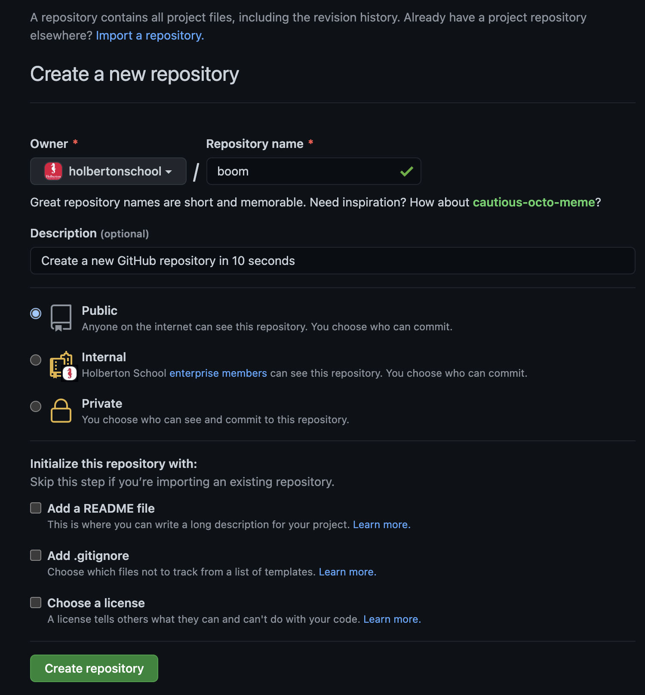
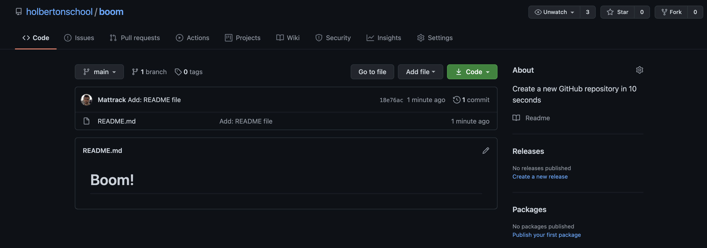
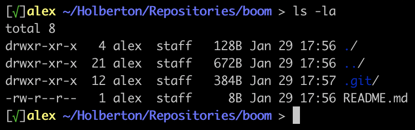

# Git and Github cheat sheet - Everything in less than 30 seconds

## Create and setup a new repository in 15 seconds

Go to [Github](https://github.com/), log-in and find the green button to create a new repository. Click on it.

You should see this:



Fill in the repository `name`, and the `description` and click on the green button **“Create repository”**. Do not initialize this repository with a README.

You should see this now:


Now in your computer’s terminal, create the directory that will contain your code and `cd` into it:


Now let’s setup our repository, and `push` a very simple README file:


Now if you refresh your repository page on GitHub, you should see the `README.md` file there:



On your computer, you should have a `.git` directory inside your directory.



All done.

## Add new (versions of) files and commit in 5 seconds

After working on your project, you can add, commit and push new and modified files to your GitHub, with 3 commands:

```shell
git add <file(s) to add>
git commit -m <A meaningful commit message>
git push
```

Here’s an example. Let’s say we created a `main.c` file, and we want to push it:


Now on GitHub, we can see that the file was correctly pushed:


